# Exercice 02 : Infrastructure Active Directory & Automatisation du Provisioning

Ce volet technique présente le déploiement complet, l'industrialisation et la sécurisation d'une infrastructure d'identité basée sur **Active Directory Domain Services (AD DS)** sous Windows Server 2022 Standard (virtualisé sous Proxmox). 

L'objectif principal est de valider les mécanismes de provisioning automatisé en masse (comptes et groupes de sécurité) à partir d'un fichier de données CSV via un script robuste développé en **PowerShell**.

---

## 📐 1. Spécifications du Provisioning et Règles de Gestion
Le script d'automatisation applique des règles de gestion strictes conformes aux bonnes pratiques de sécurité d'un système d'information :
* **Nomenclature des identifiants (SamAccountName) :** Génération dynamique et normalisée au format `prenom.nom` converti intégralement en minuscules.
* **Hardening des authentifications :** Attribution initiale d'un mot de passe fort global respectant la politique de complexité (`Azerty_2025!`).
* **Cycle de vie et cycle de confiance :** Activation systématique de l'attribut `ChangePasswordAtLogon` à `$true`, forçant chaque collaborateur à renouveler son secret dès la première ouverture de session.
* **Gestion dynamique multi-groupes :** Analyse itérative des colonnes de groupes. Le script instancie le groupe de sécurité Global s'il est absent de l'annuaire avant d'y intégrer l'utilisateur, évitant ainsi tout doublon ou erreur de référence.

---

## 🚀 2. Guide de Déploiement Étape par Étape

### Étape 2.1 : Configuration Réseau Statique et Nommage de la Machine
Avant toute promotion Active Directory, le serveur doit posséder une identité réseau immuable. Configuration de l'IP fixe en `.100`, de la passerelle en `.2`, du DNS local sur la boucle de retour (`127.0.0.1`), et renommage de la machine en `DC01` via PowerShell Administrateur :

```powershell
$NetAdapter = Get-NetAdapter | Where-Object {$_.Status -eq "Up"} | Select-Object -First 1
New-NetIPAddress -InterfaceAlias $NetAdapter.Name -IPAddress "192.168.221.100" -PrefixLength 24 -DefaultGateway "192.168.221.2"
Set-DnsClientServerAddress -InterfaceAlias $NetAdapter.Name -ServerAddresses "127.0.0.1"
Rename-Computer -NewName "DC01" -Force -Restart

```

| Configuration Réseau Initiale | Audit de Conformité (ipconfig / hostname) |
| --- | --- |
| 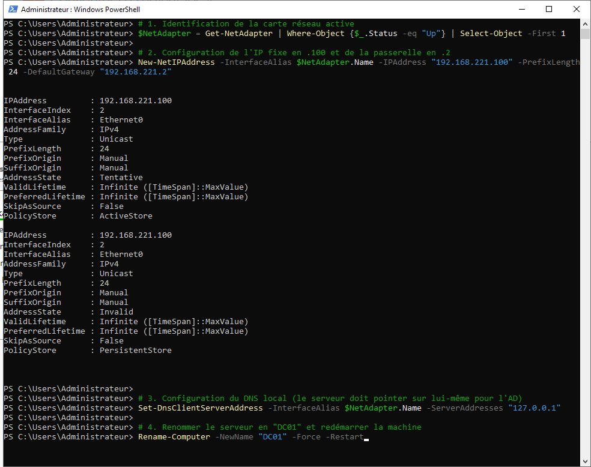 | 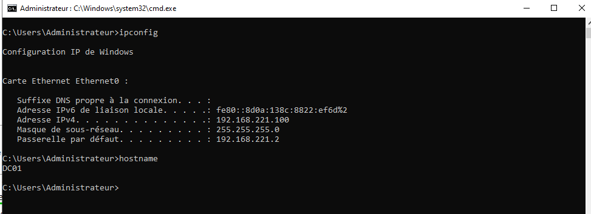 |

---

### Étape 2.2 : Déploiement des Services de Domaine AD DS

Installation des binaires du rôle Active Directory et des outils d'administration RSAT associés via la CLI :

```powershell
Install-WindowsFeature -Name AD-Domain-Services -IncludeManagementTools

```

| Progression de l'installation | Validation des dépendances | Validation finale du rôle |
| --- | --- | --- |
| 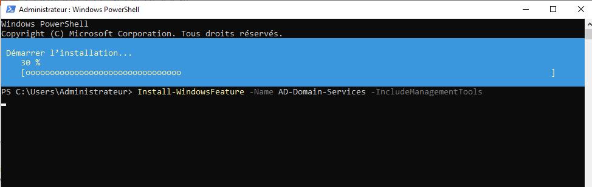 | 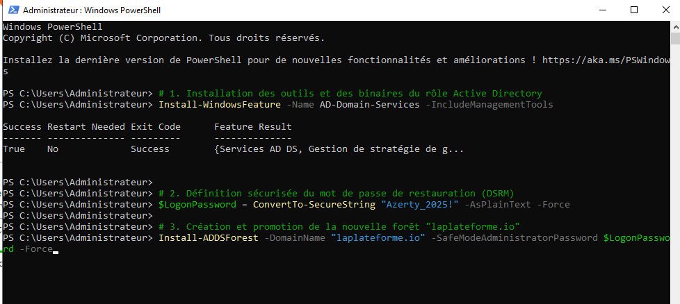 | 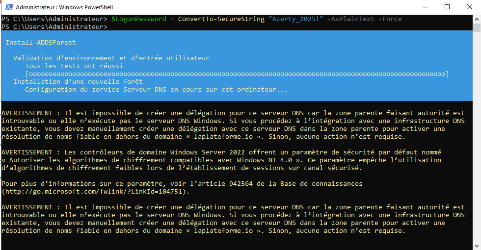 |

---

### Étape 2.3 : Promotion et Instanciation de la Forêt Racine

Création de la nouvelle forêt racine pour le domaine cible défini : `laplateforme.io`.

```powershell
$LogonPassword = ConvertTo-SecureString "Azerty_2025!" -AsPlainText -Force
Install-ADDSForest -DomainName "laplateforme.io" -SafeModeAdministratorPassword $LogonPassword -Force

```

Après traitement des partitions d'annuaire et redémarrage automatique, la mire d'authentification et le Gestionnaire de serveur confirment le passage effectif sur le domaine de sécurité :

| Prise en compte du domaine (NetBIOS) | Tableau de bord AD DS / DNS au vert |
| --- | --- |
| 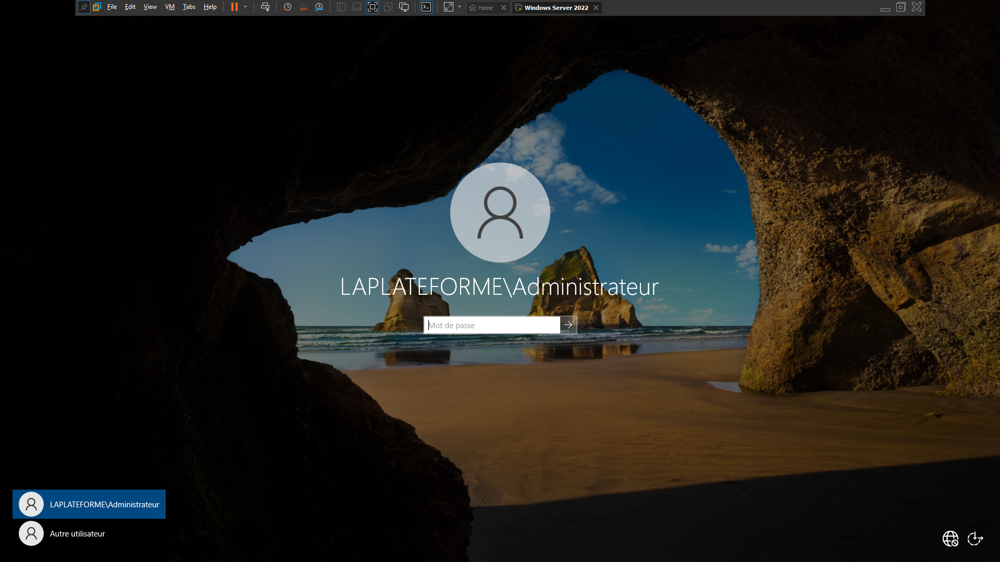 | 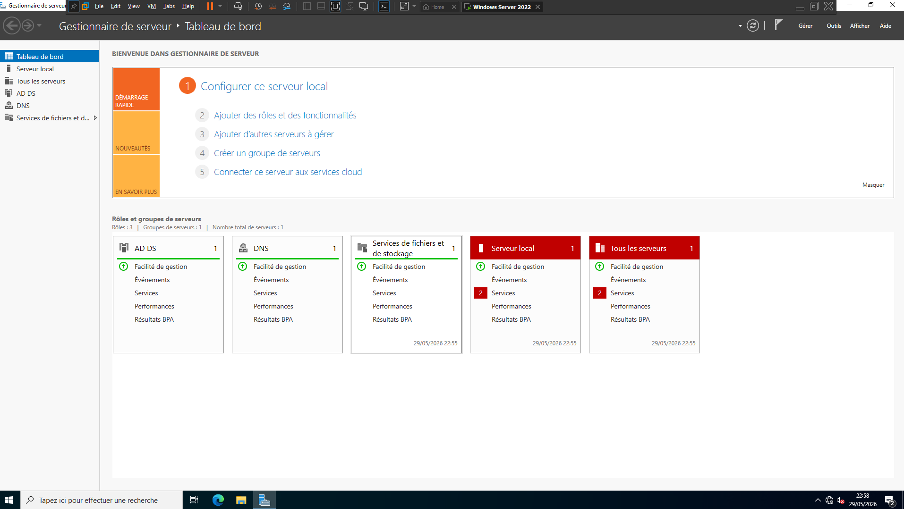 |

---

### Étape 2.4 : Parsing et Intégration du Fichier Source des Employés

Le listing des collaborateurs fourni par la direction des ressources humaines est structuré sous forme de fichier plat standardisé `utilisateurs.csv` :

---

### Étape 2.5 : Automatisation et Logs d'Exécution du Script

Lancement du script industriel au sein de l'environnement de script intégré (PowerShell ISE) en mode privilégié.

| Chargement du script de peuplement | Console de logs (Instanciation dynamique) |
| --- | --- |
| 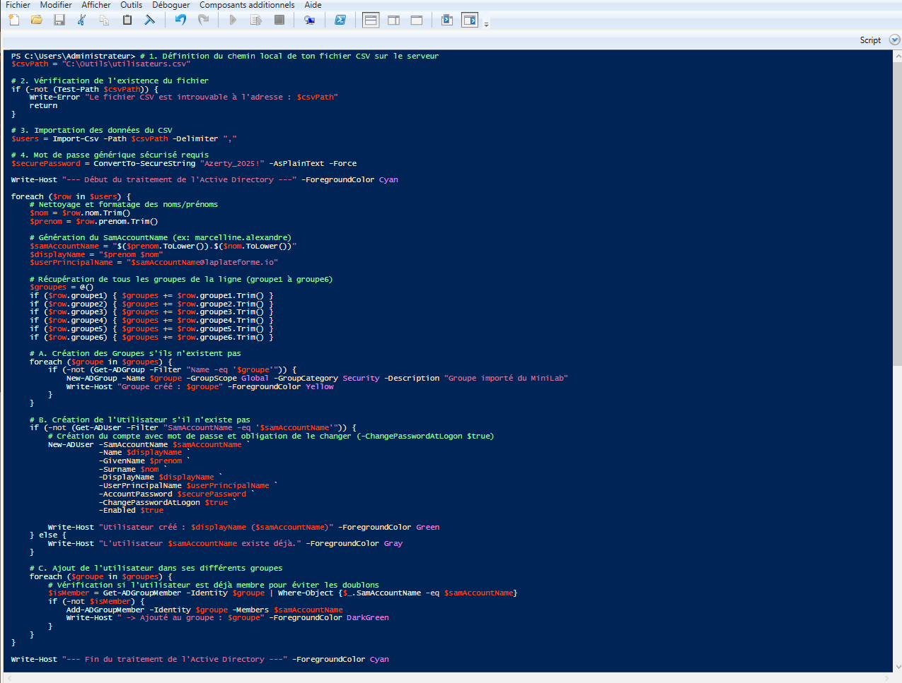 | 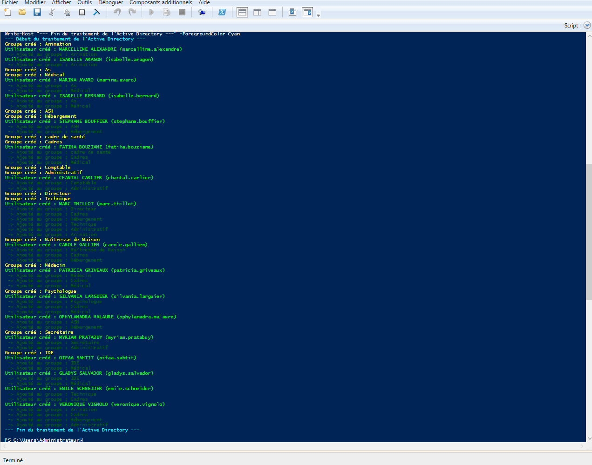 |

---

## 🧪 3. Phase d'Audit et de Validation de l'Annuaire

Pour confirmer le succès de l'opération, un audit visuel et programmatique de la base de données Active Directory (NTDS) est réalisé.

### A. Audit Visuel via la console MMC (dsa.msc)

L'ouverture de la console graphique *Utilisateurs et ordinateurs Active Directory* confirme l'injection complète des comptes nominatifs et des groupes globaux au sein du conteneur structurel **Users**.

| Racine logique du domaine | Liste des comptes et groupes générés |
| --- | --- |
| 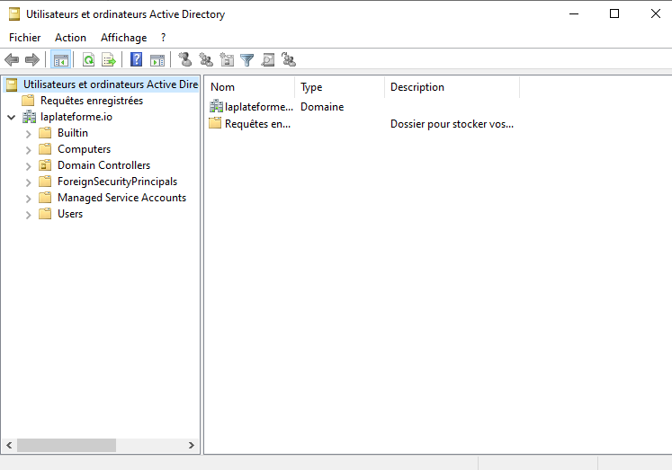 | 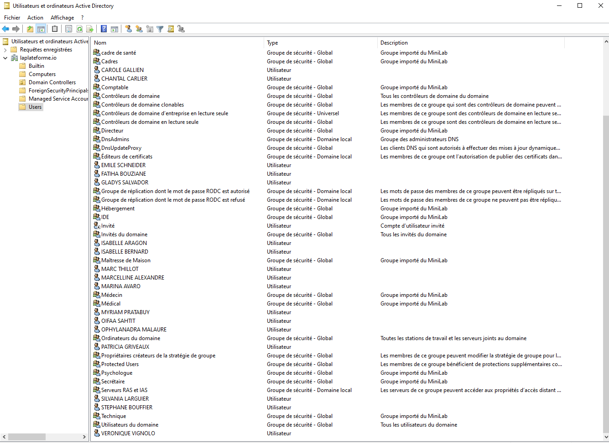 |

### B. Contrôle des Imbrications et de la Multi-Appartenance

L'analyse fine des propriétés de l'objet de sécurité Global (Exemple : groupe *Médical*) valide la bonne répartition automatique des employés selon la matrice d'appartenance :


### C. Requêtage de Bas Niveau en Ligne de Commande (CLI)

Vérification de la base SAM étendue du contrôleur à l'aide des utilitaires natifs `net user` et `net group` :

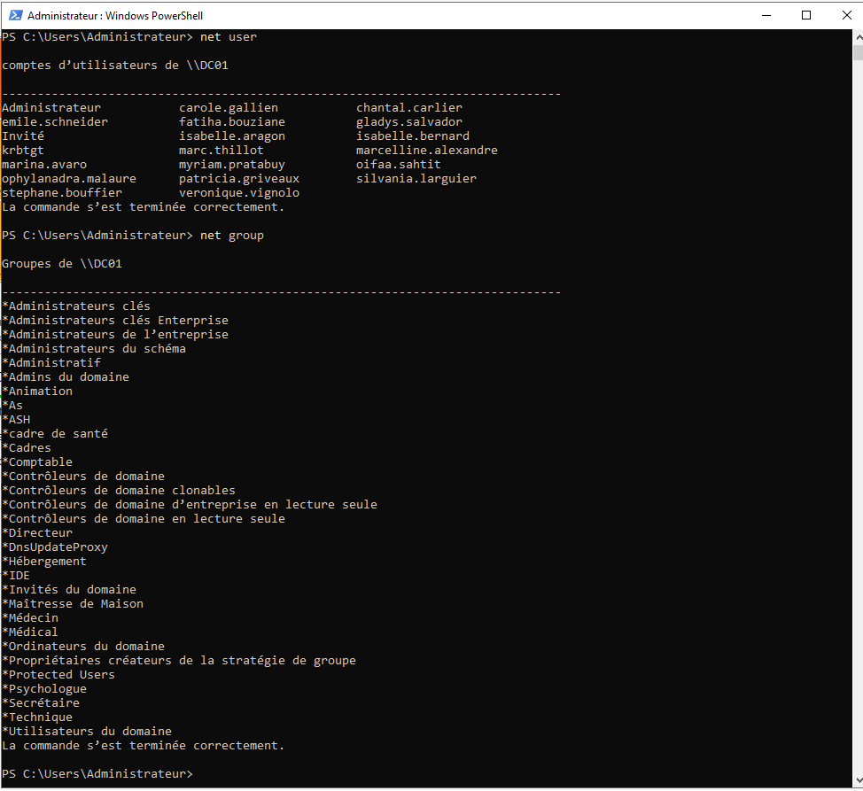

---

## 🔐 4. Validation de la Politique d'Authentification (Poste Client)

Afin de valider la contrainte de sécurité critique imposant le changement de mot de passe obligatoire à la première ouverture de session, une séquence complète de connexion est opérée depuis un poste client joint au domaine avec l'utilisateur `marcelline.alexandre`.

```text
Identifiant UPN : marcelline.alexandre@laplateforme.io
Mot de passe initial : Azerty_2025!

```

| 1. Saisie des identifiants | 2. Interception par les politiques GPO | 3. Validation de la mise en conformité |
| --- | --- | --- |
|  | 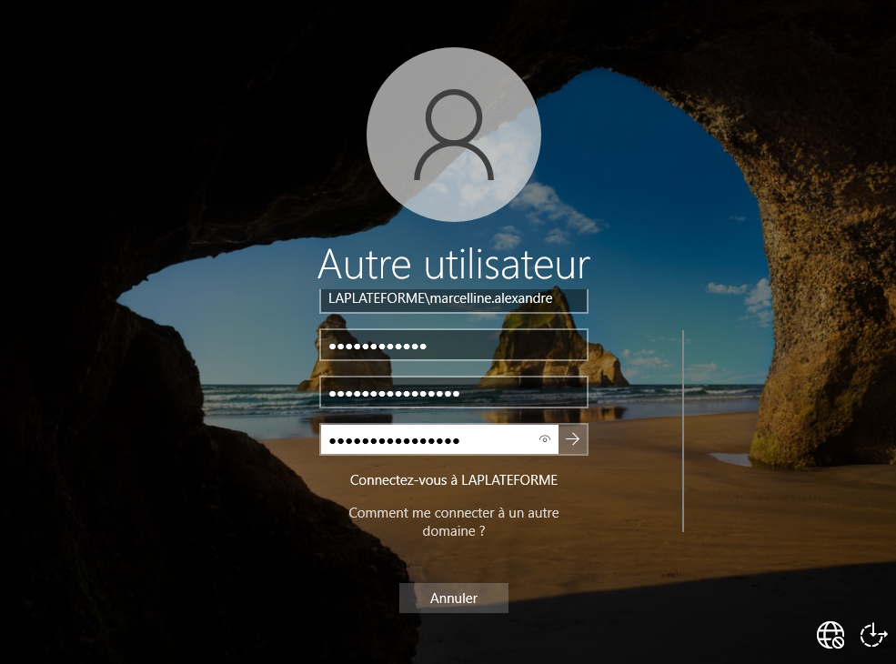 |  |

---

## 🎯 Indicateurs de Réussite (KPIs)

* **[OK]** Adressage IP fixe et résilience DNS locale configurés
* **[OK]** Rôle Active Directory Domain Services opérationnel
* **[OK]** Forêt racine `laplateforme.io` instanciée
* **[OK]** Parsing du fichier CSV et assainissement des chaînes de caractères
* **[OK]** Provisioning automatique des Groupes Globaux sans duplication
* **[OK]** Création en masse des comptes utilisateurs nominatifs
* **[OK]** Application de la contrainte de sécurité `-ChangePasswordAtLogon $true`
* **[OK]** Validation de l'authentification et de la rotation des secrets côté client

---

## 🛠️ Stack Technique & Compétences Mises en Œuvre

* **Système d'Exploitation :** Windows Server 2022 Standard Edition
* **Langage d'Automatisation :** PowerShell v5.1 (ActiveDirectory Module)
* **Identity & Access Management (IAM) :** Active Directory Domain Services (AD DS)
* **Hyperviseur de Production :** Proxmox VE
* **Gestion des Politiques de Sécurité :** Group Policy Objects (GPO) / Sécurisation des terminaux (Hardening)
